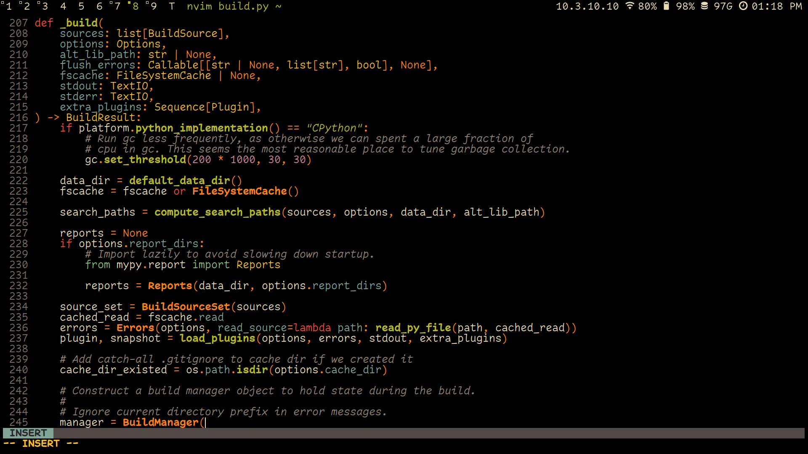
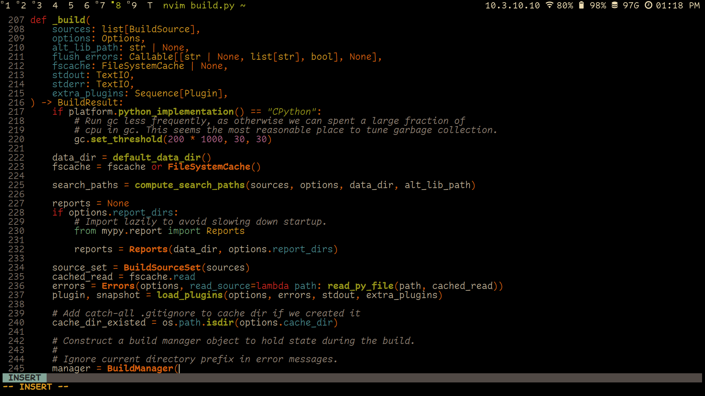
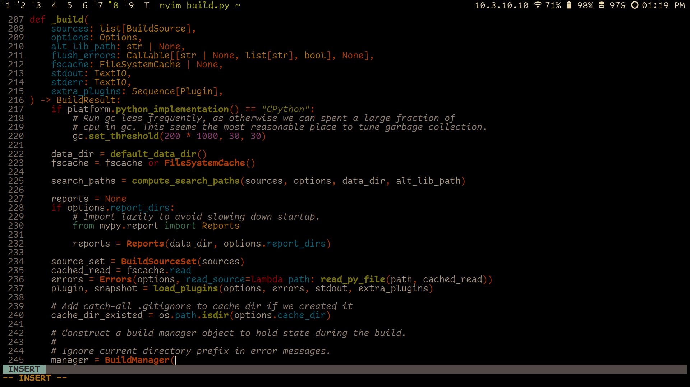

# 🎨 Darkbox.nvim

A pure-black refresh of the retro-groove aesthetic for modern displays. Darkbox brings the classic groove style into the modern era with a focus on OLED-friendly pure blacks and carefully selected contrasts.

## ✨ Features

- Pure black (#000000) background optimized for OLED displays
- Retro-groove inspired color palette with modern refinements
- Built-in support for tree-sitter

## 📸 Screenshots

### Classic


### Retro 


### Dim


## 🚀 Installation

### Using [lazy.nvim](https://github.com/folke/lazy.nvim)

Add the following to your Neovim configuration:

```lua
return {
  "timmypidashev/darkbox.nvim",
  lazy = false,
  config = function()
    require("darkbox").load()
  end
}
```

## ✏️ Configuration

Additional settings for darkbox are available:
```lua
-- Default options:
require("darkbox").setup({
  terminal_colors = true, -- add neovim terminal colors
  undercurl = true,
  underline = true,
  bold = true,
  italic = {
    strings = true,
    emphasis = true,
    comments = true,
    operators = false,
    folds = true,
  },
  strikethrough = true,
  invert_selection = false,
  invert_signs = false,
  invert_tabline = false,
  invert_intend_guides = false,
  inverse = true, -- invert background for search, diffs, statuslines and errors
  contrast = "", -- can be "retro", "dim" or empty string for classic
  palette_overrides = {},
  overrides = {},
  dim_inactive = false,
  transparent_mode = false,
})
vim.cmd("colorscheme darkbox")
```

**VERY IMPORTANT**: Make sure to call setup() **BEFORE** calling the colorscheme command, to use your custom configs

## 🔧 Overrides 

### Palette 

You can specify your own palette colors. For example:

```lua
require("darkbox").setup({
    palette_overrides = {
       base_red = "#991900",
    }
})
vim.cmd("colorscheme darkbox")
```

## 🤝 Contributing

Contributions are welcome! Feel free to:

1. Report issues
2. Suggest improvements
3. Create pull requests
4. Share your configurations

## 📝 License

MIT License - See [LICENSE](LICENSE) for details

---
View the [project page](https://timmypidashev.dev/projects/darkbox) for darkbox on my website for more info :D

Made with ♥️ by [timmypidashev](https://github.com/timmypidashev)
