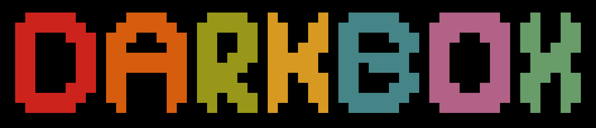
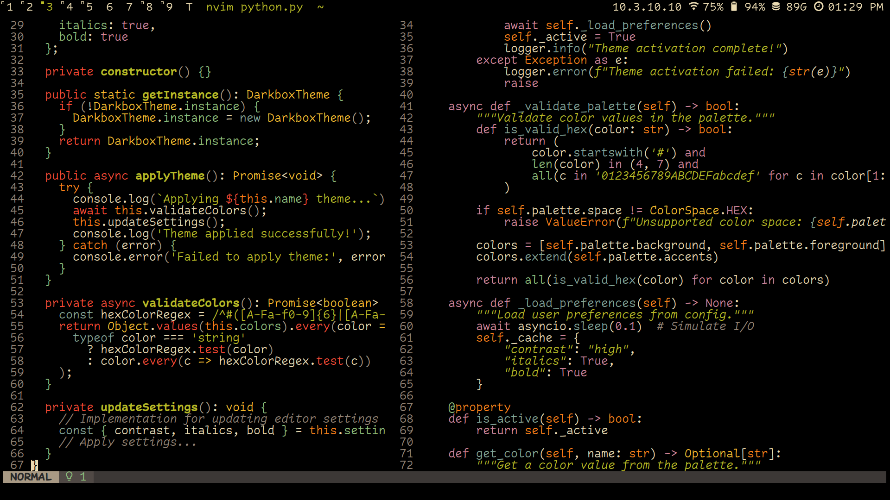

# 🎨 Darkbox.nvim

A pure-black refresh of the retro-groove aesthetic for modern displays. Darkbox brings the classic groove style into the modern era with a focus on OLED-friendly pure blacks and carefully selected contrasts.

## ✨ Features

- Pure black (#000000) background optimized for OLED displays
- Retro-groove inspired color palette with modern refinements
- Built-in support for tree-sitter

## 🚀 Installation

### Using [lazy.nvim](https://github.com/folke/lazy.nvim)

Add the following to your Neovim configuration:

```lua
return {
  "timmypidashev/darkbox.nvim",
  lazy = false,
  config = function()
    require("darkbox").load()
  end
}
```

## 📸 Screenshot



## 🤝 Contributing

Contributions are welcome! Feel free to:

1. Report issues
2. Suggest improvements
3. Create pull requests
4. Share your configurations

## 📝 License

MIT License - See [LICENSE](LICENSE) for details

---
View the [project page](https://timmypidashev.dev/projects/darkbox) for darkbox on my website for more info :D

Made with ♥️ by [timmypidashev](https://github.com/timmypidashev)
